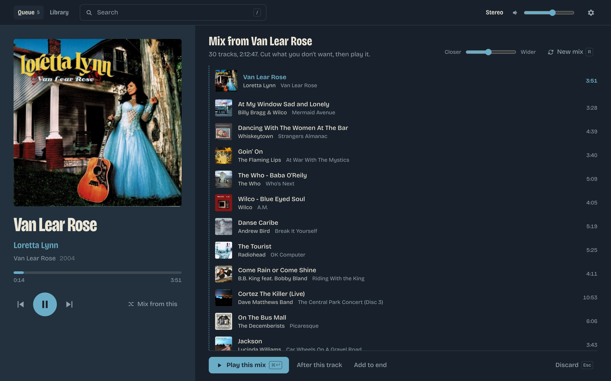

# Mixdesk

A web interface for Lyrion Music Server built around one way of listening:
pick a seed track, let MusicIP build the mix, then steer it by cutting and
adding tracks.



## Requirements

Mixdesk is a front end. All the mixing is done by Lyrion Music Server and
its plugins, so it needs:

| | | |
| --- | --- | --- |
| **Lyrion Music Server** 9.0 or later | Required | Formerly Logitech Media Server. Mixdesk talks to it over its JSON-RPC API. |
| **MusicIP** plugin | Required | Mixdesk asks it for every mix (`musicip mix`) and for the variety setting. Enable it under *Settings → Manage Plugins*, or install it from the plugin list if your LMS doesn't include it. |
| **MusicIP Mixer** (the MusicIP service) | Required | The plugin is only a bridge. The MusicIP service must be running somewhere LMS can reach, with your library analysed. Tracks it hasn't analysed can be played but not mixed from. |
| **Material Skin** plugin | Strongly recommended | The Settings view (gear icon) frames LMS's settings pages as Material styles them. Mixdesk also asks for cover art only at the sizes Material makes LMS pre-cache (150, 300, 600px); without Material, LMS resizes covers on request, which stalls the server while it works. |
| **Don't Stop The Music** plugin | Optional | Bundled with LMS. Not used by Mixdesk directly, but if you set it to MusicIP mixes it keeps the queue going, and the variety slider applies to it too. |

A modern browser (Chrome, Safari, Firefox, Edge). The app loads its typeface
from Google Fonts, and falls back to a system font when offline.

## Install

1. Download `Mixdesk-<version>.zip` from the
   [releases](../../releases) page, or build it yourself (below).
2. Unzip it into one of LMS's plugin folders, so you have
   `.../Plugins/Mixdesk/install.xml`. *Settings → Information* lists the
   folders your server reads. For the Docker image this is
   `<config>/cache/Plugins`. Don't use `InstalledPlugins`: LMS removes
   anything there that it didn't install from a repository.
3. Restart LMS. Mixdesk appears under *Settings → Manage Plugins* and is
   enabled by default.
4. Open `http://<your-lms>:9000/mixdesk/` on any device.

## Develop

Needs Node.js 22.12 or later.

```
cp .env.example .env.local   # set LMS_HOST to your server, e.g. http://192.168.1.10:9000
npm install
npm run dev                  # http://localhost:5180
```

Vite forwards `/jsonrpc.js` and `/music` to LMS so the browser stays
same-origin. LMS doesn't send CORS headers, so a direct cross-origin call
would fail. It also forwards LMS's settings pages (`/settings`, `/plugins`)
and the files they need (`/html`, `/material`, ...), which the Settings view
shows in a frame.

To build the plugin and copy it to your server:

```
npm run package   # build/Mixdesk (the plugin) and build/Mixdesk-<version>.zip
npm run deploy    # package, then copy to MIXDESK_DEPLOY over ssh
```

`MIXDESK_DEPLOY` (in `.env.local`) is `host:path` to a plugin folder on the
server, e.g. `nas:/volume1/docker/lms/cache/Plugins` for a Docker install
whose `/config` is `/volume1/docker/lms`. The version in `package.json` is
stamped into the plugin's `install.xml`.

Restart LMS after the first deploy, and whenever `Plugin.pm` changes. App
changes are live as soon as a deploy finishes; just reload the page.

## How it works

- **Running order** (right): what's playing and what's next, with each
  track's length. Played tracks are folded away.
- **Draft mixes**: "Mix from" asks MusicIP (`musicip mix`) for a mix *without
  touching the queue*. Cut what you don't want, then play it, queue it after
  the current track, or add it to the end. "New mix" asks again; MusicIP mixes
  are random, so each one is different.
- **Variety** slider writes `plugin.musicip:mix_variety`, the same server pref
  Don't Stop The Music uses for its automatic mixes.
- **Don't Stop The Music** seeds its next mix from five random tracks across the
  *whole* queue, played tracks included (see
  `Slim/Plugin/DontStopTheMusic/Plugin.pm`, `getMixableProperties`). That's
  why cutting a track, or clearing played tracks, changes where the mix goes.

## Keys

| Key | Running order | Draft |
| --- | --- | --- |
| `/` or `⌘K` | Search | Search |
| `j` `k` / arrows | Move selection | Move selection |
| `x` / Delete | Cut | Cut from draft |
| `n` | Play next | |
| `m` | Mix from selected | |
| `Enter` | Jump to selected | |
| `r` | | New mix |
| `⌘Enter` | | Play this mix (replaces queue) |
| `Esc` | | Discard |
| `u` / `⌘Z` | Undo the last cut or queue replacement | |
| Space | Play / pause | Play / pause |
| `q` / `l` | Go to the queue / library | |

Any other letter opens search with that letter typed in, so you can type
without opening search first. Searches starting with q or l need `/` first.

In search, `Enter` does the obvious thing for each kind of result and the
modifiers mean the same everywhere:

| | Enter | ⌘Enter | Shift+Enter | Alt+Enter |
| --- | --- | --- | --- | --- |
| Track | Mix from it | Play now | Play next | Add to end |
| Album | Open | Play (replaces queue, undoable) | Play next | Add to end |
| Artist | Open | Mix from artist | | |

The highlighted result also shows these as buttons. Mix options only appear
when MusicIP has analysed the track, album or artist. Tracks are listed
first unless the query exactly names an artist or album and no track.

## License

GPL-2.0, the same as Lyrion Music Server. See [LICENSE](LICENSE).
